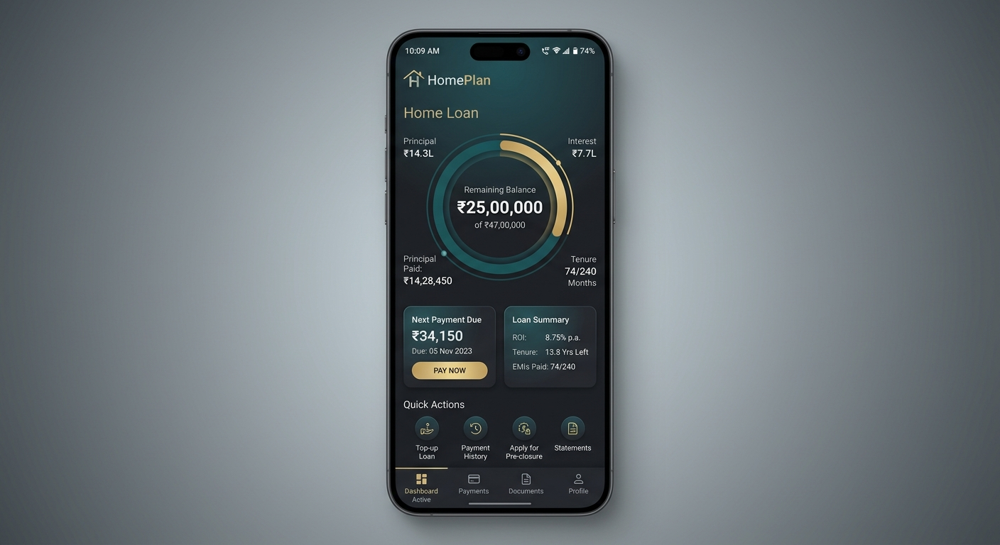
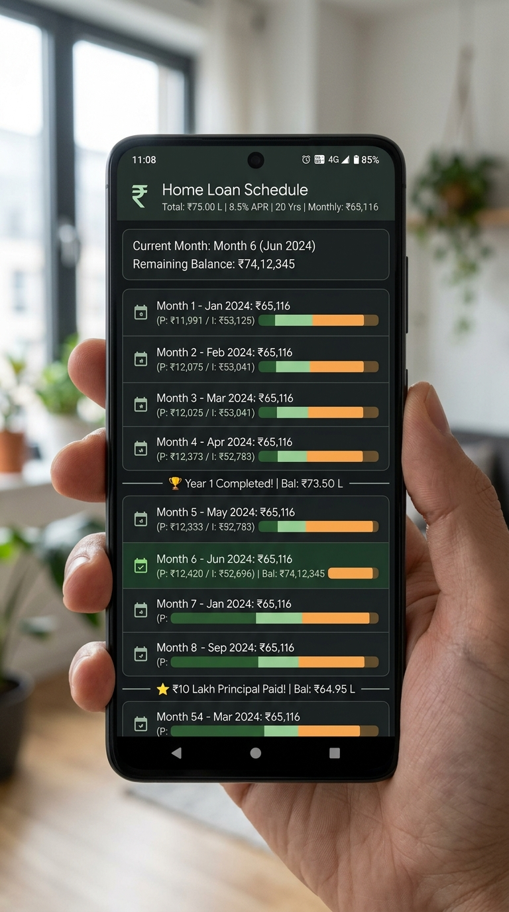
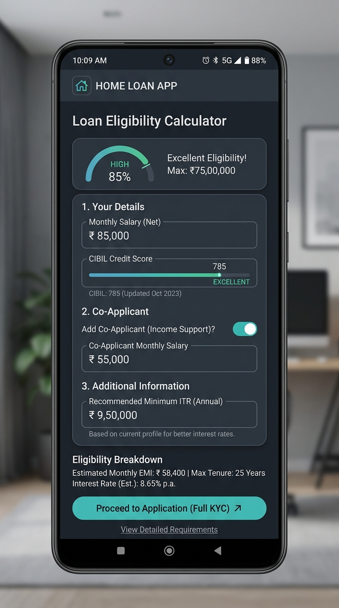
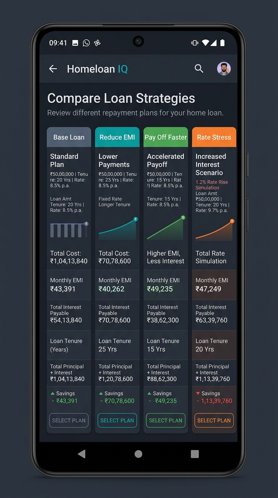
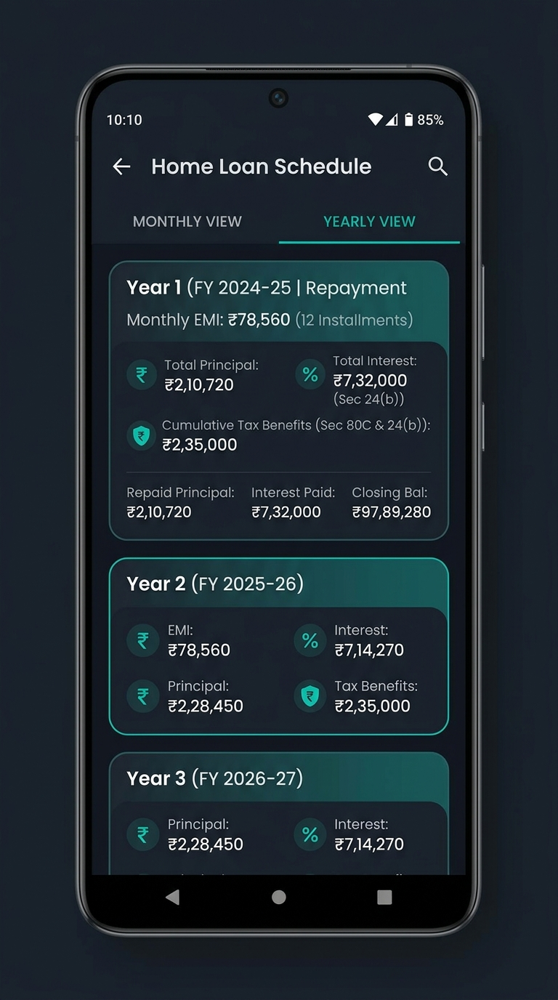
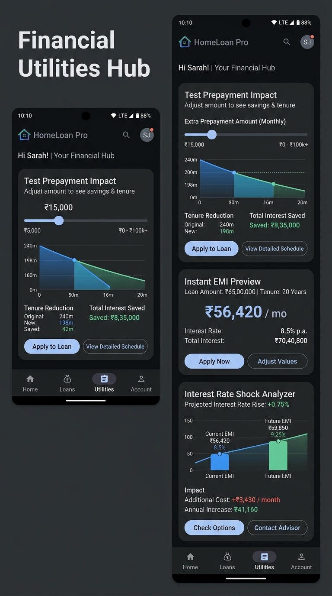

<p align="center">
  
  &nbsp;
  
  &nbsp;
  
</p>

<p align="center">
  
  &nbsp;
  
  &nbsp;
  
  &nbsp;
  
  &nbsp;
  
  &nbsp;
  
</p>

<h1 align="center">🏠 HomePlan</h1>

<p align="center">
<em>Your home loan, finally in plain English.<br>
Know every rupee you owe — and exactly how to pay less.</em>
</p>

<p align="center">
  <a href="https://github.com/Nishanth20/HomePlan-android/releases/latest">
    
  </a>
  &nbsp;
  
</p>

> **APK size is 12–20 MB.** If your download shows under 5 MB,
> it did not download correctly. Try again from the
> [Releases](https://github.com/Nishanth20/HomePlan-android/releases/latest) tab.

> Most people sign a home loan and never look at it again.
> They know the EMI. They don't know they'll pay nearly **double**
> the loan amount by the time it ends.
> They don't know that ₹1 lakh paid extra in Year 2 saves ₹3 lakhs in interest.
> They don't know if they even qualify for the loan they want.
>
> HomePlan fixes all of that. For free.

## What HomePlan does

🔢 Enter your loan — HomePlan maps every single month from today to your last payment.
💰 Add any extra payments — see exactly how much interest you save and how early you finish.
✅ Check if you qualify — know before you go to the bank what loan your income actually supports.

## Who this is for

| If you are... | HomePlan shows you... |
| :--- | :--- |
| Someone with an existing home loan | Where every rupee of your EMI goes — month by month — for 20 years |
| A first-time buyer not sure if you qualify | How much loan your salary supports based on real bank formulas |
| Anyone who got a rate hike from their bank | The exact total cost of that hike — and your options |
| Someone with a bonus or FD maturity | How much one prepayment saves — to the exact rupee |
| A self-employed person planning a loan | What your ITR must declare for the bank to say yes |
| A couple applying together | How a co-applicant changes your loan ceiling — and by how much |

## Screenshots

| Dashboard | Payment Schedule | Compare Strategies |
|:---:|:---:|:---:|
|  |  |  |
| *Loan health score, EMI, charts, and savings summary* | *Every month — what you pay, what reduces your loan, what saves tax* | *4 strategies compared side by side with bar chart* |

| Year by Year | Tools | Loan Eligibility |
|:---:|:---:|:---:|
|  |  |  |
| *20 years rolled into expandable yearly cards* | *EMI calculator, prepayment slider, rate shock test* | *FOIR, CIBIL impact, ITR requirement, co-applicant analysis* |

## Features

### 📊 Loan Planning

| Feature | What it does |
| :--- | :--- |
| Month-by-month schedule | Every payment split into interest and principal — from month 1 to your last EMI |
| Pay Less Monthly | EMI drops after each extra payment — more money in hand |
| Pay Off Faster | EMI stays same, loan ends years earlier — saves the most interest (recommended) |
| Lump sum prepayments | Add any bonus or maturity payout in any specific month |
| Extra EMI | Pay one or more full extra EMIs in any month |
| Rate change planner | Enter your bank's future rate revision — simulation applies it mid-loan |
| Loan health score | 0–100 score showing how efficiently you are managing your loan |
| Smart prepayment tips | The 3 best months to prepay for maximum interest saving |

### 🔁 Strategy Comparison

| Scenario | What it tests |
| :--- | :--- |
| Base Loan | No prepayments — your baseline cost and payoff date |
| Pay Less Monthly | Your plan with EMI reduction after each prepayment |
| Pay Off Faster | Your plan with shorter tenure — saves the most |
| Rate +2% | What happens if your bank raises rates by 2% |

### 🏦 Loan Eligibility Checker

| Feature | What you get |
| :--- | :--- |
| FOIR calculator | PSU 50% · Private 55% · NBFC 60% — your income run through each |
| CIBIL impact table | How your score changes your rate and monthly EMI |
| ITR requirement | The exact income your ITR must declare for the bank to approve |
| Co-applicant analysis | Eligible loan with and without a co-applicant — side by side |
| Shortfall fix guide | 3 specific ways to close the gap if you fall short |
| Woman co-applicant flag | 0.05% rate concession available at most banks — shown with savings |

### 🧾 Tax Savings Tracked

| Section | Annual Cap | What you see |
| :--- | :--- | :--- |
| Section 24(b) | ₹2,00,000 | Monthly and annual interest deduction — lifetime total |
| Section 80C | ₹1,50,000 | Monthly and annual principal deduction — lifetime total |

*Estimates based on 2025–26 tax rules. Confirm with your CA before filing.*

### 🔧 Financial Tools

| Tool | How to use |
| :--- | :--- |
| EMI Calculator | Enter any amount, rate, tenure — EMI and total interest in one tap |
| Prepayment Impact | Slide to any amount and month — see months saved and interest cut live |
| Rate Shock Test | Slide from -2% to +3% — see your new cost immediately |
| Best Month to Prepay | Enter target saving — app finds the deadline month automatically |

### 📤 Export

| Format | Contents |
| :--- | :--- |
| PDF Report | Loan summary · scenarios · annual breakdown · full monthly schedule |
| CSV Sheet | All columns — opens directly in Excel or Google Sheets |
| ZIP Bundle | All 4 data sheets as separate CSVs in one file |
| Print | Send any PDF to your Android print system directly |

### ✨ App Experience

| Feature | Detail |
| :--- | :--- |
| Dark mode + light mode | Toggle from the dashboard. Preference saves automatically. |
| First-launch tutorial | 5-step walkthrough explaining EMI, prepayments, and eligibility |
| Info (i) buttons | Every input field explains itself in plain English — tap to read |
| Loan profiles | Save and switch between multiple loan scenarios |
| Payment milestones | See which month you hit 25%, 50%, 75% paid off |
| Indian number format | ₹ lakhs and crores — never Western millions |
| Fully offline | No internet. No login. No ads. Nothing leaves your phone. |

## How it works

1. **Enter your loan** — tap the pencil icon, fill in amount, rate, tenure, start date.
2. **Add your plan** — enter lump sum payments or extra EMIs you expect to make.
3. **Tap Calculate** — every screen updates instantly with your complete loan picture.
4. **Check eligibility first** — if you haven't applied yet, use the Eligibility tab before walking into the bank.

## Getting started

### Download and install

1. Go to the **[Releases](https://github.com/Nishanth20/HomePlan-android/releases/latest)** tab of this repo (right sidebar or link above).
2. Under **Assets**, tap or click **HomePlan-android.apk** to download it.
3. Once downloaded, open the APK file on your Android phone.

**If Android says "Install blocked" or asks for permission:**
- Go to **Settings → Apps → Special app access → Install unknown apps**
- Find your browser (Chrome / Firefox) or file manager
- Toggle **Allow from this source** → ON
- Go back and tap the APK file again

**If Android says "Can't install app / There's a problem with the app file":**

This error means the APK file did not download correctly or was corrupted.
Try these steps in order:

Step 1: Clear your browser downloads and download the APK again from the Releases tab.

Step 2: If downloading on a laptop — transfer the file to your phone using a USB cable, not WhatsApp or Telegram. WhatsApp compresses and corrupts APK files during transfer.

Step 3: If using WhatsApp to transfer — go to WhatsApp → Settings → Storage → find the APK in Documents → tap it to install. Do not use the APK from the Downloads folder after a WhatsApp transfer.

Step 4: Download using Chrome browser on your Android phone directly from this page — this is the most reliable method.

> **Why Google Play Protect shows a warning:**
> This APK is not distributed through the Play Store.
> Android shows a security warning for all sideloaded apps.
> HomePlan requests **zero permissions** and contains **no network code**.
> To proceed: tap **More details → Install anyway**.

### Requirements

| Requirement | Detail |
|---|---|
| Android version | 8.0 (Oreo) or above — covers 95%+ of phones in use in India today |
| Storage | 12–20 MB |
| Internet | Never required |
| Account or login | Never required |
| Permissions | None — the app requests zero device permissions |

### Build from source (for developers)

```bash
git clone https://github.com/Nishanth20/HomePlan-android.git
```

Open in **Android Studio Hedgehog 2023.1.1** or later.
Sync Gradle. Run on any emulator (API 26+) or physical device.
No API keys. No configuration. Builds and runs out of the box.

## How banks actually decide your loan amount

When you apply for a housing loan, banks don't just blindly approve any amount based on your salary. They calculate how much of your monthly income is left after meeting your existing monthly expenses and obligations. This is what banks call FOIR (Fixed Obligation to Income Ratio). Generally, standard government (PSU) banks will limit your maximum EMI to 50% of your take-home income. Private banks might allow up to 55%, and other housing finance companies might go up to 60%. For example, if you earn ₹50,000 a month, a bank like SBI will cap your home loan EMI at ₹25,000 per month. That EMI limit — and not your total salary — is the absolute mathematical ceiling that determines the maximum loan amount you can qualify for.

For self-employed individuals, banks decide eligibility entirely based on your Income Tax Returns (ITR), rather than your actual daily cash revenue or untaxed business turnover. If your local business brings in ₹8 lakhs cash-in-hand annually but you declare only ₹4 lakhs in your official ITR to save on taxes, the bank will calculate your loan eligibility based strictly on that ₹4 lakhs figure. HomePlan reverses this calculation: you enter the target loan amount you need, and the app tells you exactly the minimum income your ITR must declare before you go to apply. This is incredibly valuable since most bank officers won't tell you this until your application is already rejected.

To get a higher loan, you can pool your income by adding a parent or spouse as a co-applicant. This immediately lifts the total combined income ceiling and allows you to secure a larger loan amount. Additionally, if the primary or co-applicant registered is a woman, most Indian banks offer a concession of 0.05% (5 basis points) on the interest rate. On a ₹50 lakh home loan taken for a standard tenure of 20 years, this tiny drop can save you between ₹40,000 to ₹60,000 in lifetime interest. HomePlan does these complex calculations instantly and shows you exactly how much you stand to save.

## FAQ

<details>
<summary><strong>Is HomePlan free?</strong></summary>
<br>
Yes. Free forever. No ads, no subscription, no hidden charges. MIT licence — source code is public.
</details>

<details>
<summary><strong>Does it need internet?</strong></summary>
<br>
No. Every calculation runs on your phone. Nothing is sent anywhere.
</details>

<details>
<summary><strong>Will it work on my phone?</strong></summary>
<br>
Any Android 8.0+ phone made after 2017 — including Redmi, Realme, Samsung M-series.
</details>

<details>
<summary><strong>Can I use it for a loan I already have?</strong></summary>
<br>
Yes. Enter your current outstanding balance as loan amount and your original start date.
</details>

<details>
<summary><strong>My bank raised my rate. What do I do?</strong></summary>
<br>
Go to Plan Your Loan → Rate Change Schedule. Enter the month and new rate. Tap Calculate.
</details>

<details>
<summary><strong>Is the tax calculation accurate?</strong></summary>
<br>
Follows 2025–26 rules with correct caps. Confirm final number with your CA before filing.
</details>

<details>
<summary><strong>Can I save multiple loan plans?</strong></summary>
<br>
Yes. Use Save Profile to store as many scenarios as you want.
</details>

<details>
<summary><strong>I am self-employed. Is the eligibility checker useful?</strong></summary>
<br>
Yes — specifically built for ITR-based assessment, which is how Indian banks actually evaluate self-employed borrowers.
</details>

## Tech stack

| Technology | What it does |
| :--- | :--- |
| Kotlin | Primary language |
| Jetpack Compose | Modern Android UI — 100% declarative |
| Material 3 | Design system with light and dark mode |
| Hilt | Dependency injection |
| Room | Local database for saved loan profiles |
| DataStore | Saves theme preference and last-used inputs |
| Vico Charts | Area chart, bar chart, donut chart |
| iTextG | Generates multi-page PDF reports |
| DM Sans (Google Fonts) | Main font throughout the app |
| Instrument Serif (Google Fonts) | Large EMI display on dashboard |

## Contributing

Pull requests are welcome. All loan logic lives in `domain/usecase/` — 
pure Kotlin, zero Android dependencies, easy to read and test independently.

Found a bug or have a feature idea? 
[Open an issue](https://github.com/Nishanth20/HomePlan-android/issues/new)

Please keep business logic in `usecase/` classes only — 
not in ViewModels or Composables.

## Built by

<p align="center">
  <b>Nishanth</b><br>
  Developer &amp; Designer · Hyderabad, India<br><br>
  <a href="https://www.instagram.com/Nishanth.official">
    
  </a>
  &nbsp;&nbsp;
  <a href="https://github.com/Nishanth20">
    
  </a>
</p>

<p align="center">
<em>HomePlan was built because no free tool showed an Indian borrower<br>
their complete loan picture — eligibility, prepayment, tax, and stress testing<br>
all in one place, in plain English, with Indian number formatting.<br><br>
If this saves you even ₹1 lakh in interest, it has done its job.</em>
</p>

## Privacy

- HomePlan does not connect to the internet for any reason.
- No personal or financial data is collected, stored, or transmitted.
- No analytics, no advertising SDK, no crash reporting is included.
- All calculations run locally. Your loan details never leave your phone.

## License

MIT License © 2026 Nishanth

See the [LICENSE](LICENSE) file for full terms. You are free to use, 
copy, modify, and distribute this project — including commercially — 
as long as you include the original copyright notice.
