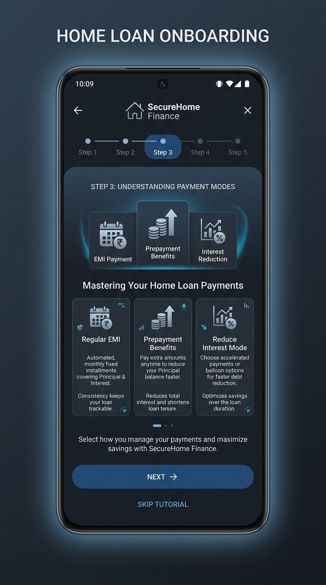

# 🏠 HomePlan-android

<p align="center">
  A production-grade, high-precision Home Loan Amortization Simulator &amp; Strategy Planner. Interactively forecast prepayments, interest stress, and Indian Section 24(b)/80C tax deductions offline.
</p>

<p align="center">
  
  
  
  
</p>

---

## 📥 Download Standalone Application

<p align="center">
  <a href="releases/download/v1.0.0/HomePlan-android.apk">
    
  </a>
</p>

> ⚠️ **Google Play Protect & Security Walkthrough:**
> Because this is a production-grade offline application published directly on GitHub (not on the commercial Google Play Store), Google's Play Protect service might prompt a *"Blocked by Play Protect"* or *"Unsafe App Blocked"* popup message on installation. 
>
> Please follow these **2 simple steps** to authorize and complete installation:
> 1. In the Play Protect prompt, click or expand **"More details"** (or tap the drop-down arrow).
> 2. Tap **"Install anyway"** to complete the installation.
>
> *🔒 **Zero Permissions, Full Privacy Guarantee:** Under our strict offline mandate, this application is built without requesting ANY network sockets or internet permissions. Because it is completely isolated locally, none of your financial calculations, salaries, or numbers can ever leave your physical device.*

---

## 📱 App Tour

<p align="center">
  
  
  
</p>

<details>
<summary><b>📐 View All Screens</b></summary>
<br>
<p align="center">
  
  
  
  
</p>
</details>

---

## ✨ Features

- **Strategic Sandbox**: Formulate prepayment strategies (**Pay Off Faster** vs. **Reduce EMI**) and perform dynamic floating **interest rate stress-tests** (+2%).
- **Deep Tax Integration**: Real-time evaluation of Indian **Section 24(b)** (interest) and **Section 80C** (principal) tax exemptions.
- **Eligibility Simulator**: Calculate maximum bank loan capabilities using Indian bank underwriting formulas (FOIR, co-applicant pool, CIBIL metrics).
- **Pro Dashboard**: Tracks your customized loan health score, recommends optimized months to prepay, and exports clean **PDF/CSV/ZIP** reports offline.
- **Privacy First**: Fully self-contained. Runs local-only with no trackers, no network permissions, and zero tracking.

---

## ⚡ Quick Start

### 1. Requirements
- **OS**: Android 8.0 (API 26) or above
- **Footprint**: ~8-12 MB
- **Runtime**: Fully self-contained offline architecture

### 2. Manual Setup
1. Click the blue **Download APK** badge above, which directly targets the release package binary file `HomePlan-android.apk`.
2. Authorize *install from unknown sources* within your Android OS security settings if requested.
3. Open the APK file to deploy, bypass the Play Protect notification as illustrated above, and complete the instant 5-step onboarding tutorial.

### 3. Developer Source Builds
```bash
git clone https://github.com/Nishanth20/HomePlan-android.git
```
Import the project into **Android Studio** (Hedgehog 2023.1.1+) and let Gradle complete sync. No API keys or network configurations are required.

---

<details>
<summary><b>📚 System Deep Dives (FOIR, Section 24b/80C, and FAQ)</b></summary>
<br>

### 🔍 Loan Eligibility Engine
In India, banks do not just look at your gross salary to decide your home loan amount. They use a critical metric called Fixed Obligation to Income Ratio (FOIR). PSU banks usually allow a maximum of 50% FOIR, private banks permit up to 55%, and NBFCs may stretch to 60%. On a ₹50,000 monthly salary with no other ongoing liabilities, a PSU bank limits your maximum monthly EMI cap to ₹25,000, which behaves as the ultimate mathematical ceiling for your total loan eligibility.

For self-employed applicants, banks judge eligibility entirely on your filed Income Tax Returns (ITR) rather than gross business turnover or unofficial ledger receipts. If your physical ITR records show a declared annual income of ₹4 lakhs despite actually earning ₹8 lakhs cash-in-hand, the underwriting engine will approve the loan exclusively matching the ₹4 lakhs limit. The Eligibility Checker dynamically reverses this flow, stating the precise minimum ITR declaration required to successfully qualify for your desired loan value.

Adding an immediate relative as a co-applicant (typically a spouse or parent) pools your overall incomes to elevate the eligible ceiling significantly. Furthermore, if the primary or co-applicant registered is a woman, many Indian financial units offer an interest rate discount of 0.05% (5 basis points). The built-in co-applicant analysis models eligibility both individually and combined, highlighting exact potential savings.

### 💰 Indian Tax Benefit Rules
- **Section 24(b)**: Up to ₹2,00,000 per year deduction against interest paid for self-occupied properties.
- **Section 80C**: Up to ₹1,50,000 deduction representing principal amortization (cumulative against other instruments).

*Tax values represent standard statutory models. Actual limits subject to individual personal filing schemes. Confirm with a Chartered Accountant.*

### ❓ FAQ

#### Is this app free?
Yes. 100% free with no ads, trackers, or hidden modules under the open OSS MIT license.

#### Does it require internet connection?
No. The engine calculates amortization matrices locally in Kotlin with no server interaction.

#### Can I backport an already active loan?
Yes. Simply specify the outstanding loan principal sum as the initial loan balance alongside your original starting date to simulate forward from today.

#### What happens if the bank changes interest rates?
Utilize the **Rate Change Schedule** timeline within the planning panel to forecast mid-term rate shifts easily.

#### What about telemetry?
The app is built without external telemetry libraries, crash reporting SDKs, or analytics trackers.

</details>

---

## 🎨 Creative Engineering

Custom-crafted under standard Android Material 3 design directives, matching standard dark-mode interfaces focused on dense typography, dynamic vector graphs, and seamless transition states. Developed by **Nishanth** under MIT license guidelines.

<p align="center">
  <a href="https://www.instagram.com/Nishanth.official">
    
  </a>
  &nbsp;
  <a href="https://github.com/Nishanth20">
    
  </a>
</p>
